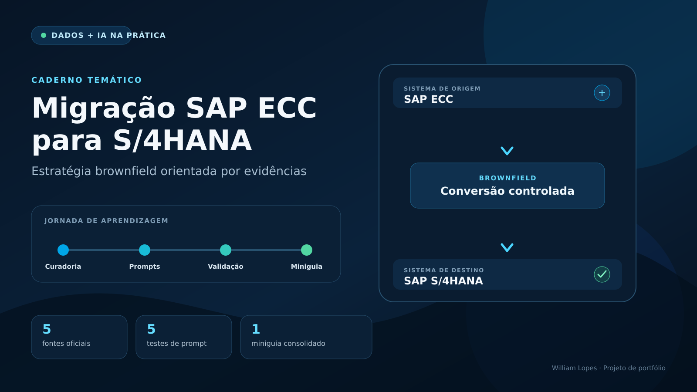

# Caderno Temático — Migração SAP ECC para S/4HANA

Estudo orientado por Inteligência Artificial sobre **conversão de sistemas SAP na abordagem brownfield**, desenvolvido como projeto prático do curso de Dados e IA. O repositório reúne curadoria de fontes oficiais, experimentos de prompt, análise crítica das respostas e um miniguia para revisão do tema.



## Por que este tema?

A conversão de SAP ECC para SAP S/4HANA não é apenas uma atualização técnica. Ela combina análise de compatibilidade, simplificações funcionais, adequação de código customizado, preparação de dados, testes integrados e planejamento de cutover.

O tema foi escolhido por sua relevância em projetos reais de transformação digital e pela necessidade de conectar decisões técnicas a impactos de negócio. O foco do estudo é compreender a jornada de conversão sem tratar a ferramenta de IA como fonte absoluta: cada afirmação importante deve estar apoiada em documentação oficial.

## Objetivos de aprendizagem

- diferenciar brownfield, greenfield e transição seletiva;
- compreender a sequência geral de uma conversão SAP S/4HANA;
- reconhecer o papel de SAP Readiness Check, Maintenance Planner, SI-Check, SUM/DMO e ATC;
- identificar riscos relacionados a simplificações, código customizado, dados e downtime;
- estruturar perguntas que exijam respostas rastreáveis e baseadas em fontes;
- transformar documentação extensa em material de estudo reutilizável.

## Entregáveis

| Arquivo | Conteúdo |
| --- | --- |
| [`docs/caderno-tematico.md`](docs/caderno-tematico.md) | Miniguia consolidado, resumo, roteiro de conversão, checklist e glossário |
| [`docs/prompts-e-testes.md`](docs/prompts-e-testes.md) | Evolução dos prompts, respostas consolidadas, referências e troubleshooting |
| [`images/capa-caderno.png`](images/capa-caderno.png) | Identidade visual do projeto |

## Curadoria de fontes

Foram selecionadas cinco fontes públicas e oficiais da SAP. A combinação cobre visão geral, planejamento, execução técnica e adaptação de código.

| ID | Fonte | Contribuição para o estudo |
| --- | --- | --- |
| F1 | [Conversion Guide for SAP S/4HANA 2025](https://help.sap.com/doc/2b87656c4eee4284a5eb8976c0fe88fc) | Sequência da conversão, pré-requisitos, ferramentas obrigatórias e atividades de preparação |
| F2 | [Converting and Upgrading SAP S/4HANA Systems](https://learning.sap.com/learning-journeys/converting-and-upgrading-sap-s-4hana-systems) | Jornada de aprendizagem e visão estruturada da conversão e do upgrade |
| F3 | [SAP Readiness Check](https://help.sap.com/docs/SAP_READINESS_CHECK) | Análise antecipada do sistema e identificação de impactos relevantes |
| F4 | [Custom Code Migration Guide for SAP S/4HANA 2025](https://help.sap.com/doc/9dcbc5e47ba54a5cbb509afaa49dd5a1/2025.000/en-US/CustomCodeMigration_EndtoEnd.pdf) | Scoping, análise ATC, adaptação e racionalização de código customizado |
| F5 | [Conversion to SAP S/4HANA using SUM 2.0](https://help.sap.com/doc/08e459b0d229498fb74efe4b64d34163/convsum20.latest/en-US/cg_s4hana_sum2_unix.pdf) | Execução com SUM, Database Migration Option e atividades técnicas da conversão |

> As fontes foram consultadas em setembro de 2026. Em um projeto real, versões, SAP Notes, requisitos de produto e matriz de disponibilidade devem ser conferidos novamente para o release-alvo.

## Método de estudo com IA

O trabalho foi organizado em quatro etapas:

1. **Delimitar:** definir o que a pesquisa deveria responder e o que estava fora do escopo.
2. **Fundamentar:** selecionar documentação oficial e atribuir um identificador a cada fonte.
3. **Interrogar:** testar prompts progressivamente mais específicos, exigindo referência e separação entre fato, recomendação e inferência.
4. **Revisar:** confrontar a síntese com as fontes, registrar limitações e transformar o resultado em um miniguia.

Os prompts foram preparados para uso no NotebookLM. As respostas registradas neste repositório foram consolidadas no formato esperado e revisadas manualmente com base nas fontes. Ao executar os mesmos prompts na ferramenta, a redação e a posição das citações podem variar.

## Principais aprendizados

- O brownfield preserva boa parte do patrimônio do sistema existente, mas não elimina a necessidade de redesenhar pontos afetados pelas simplificações.
- O **SAP Readiness Check** apoia o planejamento antecipado; o **SI-Check** verifica condições relevantes para a conversão e é obrigatório no processo.
- O **Maintenance Planner** valida componentes e add-ons e gera o arquivo de stack utilizado pelo SUM.
- O **SUM** conduz a conversão técnica; quando a origem não está em SAP HANA, o **DMO** pode combinar atualização e migração de banco em um único procedimento.
- Código customizado precisa ser classificado por uso, analisado e adaptado. A recomendação não é migrar tudo automaticamente.
- Ensaios em sandbox, ciclos de testes, reconciliação de dados e plano de cutover reduzem riscos que uma análise apenas documental não consegue eliminar.

## Estrutura do repositório

```text
caderno-sap-s4hana-brownfield/
├── docs/
│   ├── caderno-tematico.md
│   └── prompts-e-testes.md
├── images/
│   └── capa-caderno.png
├── .gitignore
└── README.md
```

## Como reproduzir no NotebookLM

1. Crie um novo caderno no NotebookLM.
2. Adicione as cinco fontes da seção de curadoria.
3. Aguarde a indexação dos materiais.
4. Execute os prompts na ordem documentada em [`docs/prompts-e-testes.md`](docs/prompts-e-testes.md).
5. Abra as citações apresentadas pela ferramenta e compare cada afirmação com a fonte correspondente.
6. Registre divergências, lacunas e mudanças necessárias.
7. Atualize o miniguia somente depois da revisão humana.

## Limites do material

Este caderno é educacional e não substitui o planejamento específico de uma conversão. Não foram usados dados de clientes, informações corporativas, credenciais, configurações de sistemas ou documentos confidenciais. Decisões de projeto devem considerar o release-alvo, o Product Availability Matrix, SAP Notes vigentes e a arquitetura real do ambiente.

## Autor

Desenvolvido por [William Lopes](https://github.com/williamlopes-ai) como projeto de portfólio em Dados e Inteligência Artificial aplicada.
