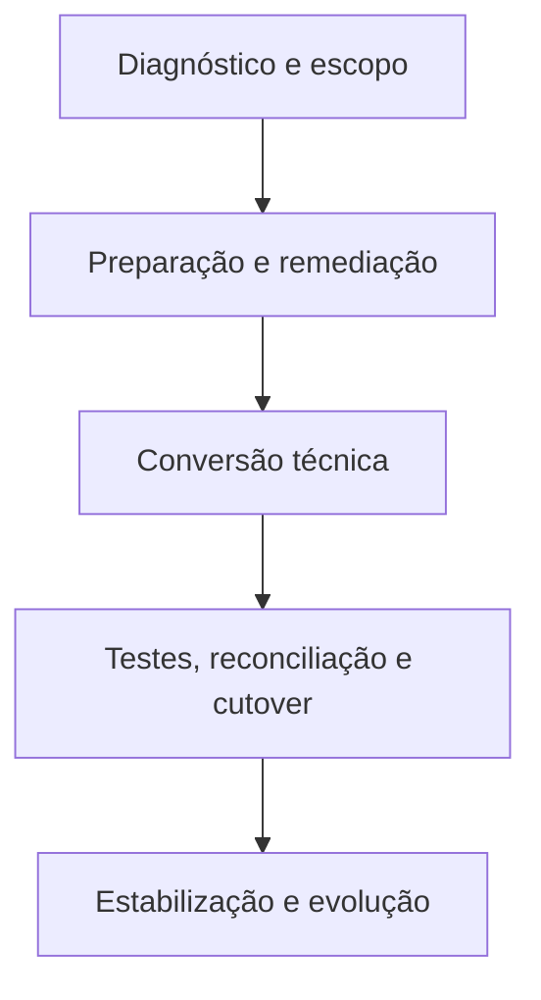

# Miniguia — Conversão SAP ECC para S/4HANA em abordagem brownfield

## 1. Visão executiva

Uma conversão brownfield transforma um sistema SAP ERP existente em SAP S/4HANA, preservando dados históricos, configurações e parte relevante dos processos já utilizados. Essa continuidade reduz a ruptura organizacional, mas não significa transportar o ambiente sem mudanças.

O modelo de dados do SAP S/4HANA, as simplificações funcionais, os requisitos técnicos e as mudanças em objetos SAP podem afetar processos e desenvolvimentos próprios. Por isso, o projeto deve combinar diagnóstico antecipado, preparação funcional e técnica, conversão controlada, testes e estabilização.

O resultado esperado não é apenas “um ECC atualizado”. É um sistema convertido, validado e capaz de operar com os requisitos do release-alvo.

## 2. Escolha da estratégia

| Estratégia | Característica central | Quando costuma fazer sentido |
| --- | --- | --- |
| Brownfield | Converte o sistema existente e preserva o histórico | Processos atuais são majoritariamente aderentes e a continuidade é prioridade |
| Greenfield | Implementa um novo sistema | A organização pretende redesenhar processos e reduzir heranças do ambiente atual |
| Transição seletiva | Combina renovação com migração escolhida de dados e processos | Há necessidade de consolidar, separar ou transformar escopos específicos |

### Perguntas antes da decisão

- Quais processos atuais devem ser preservados?
- Quanto do código customizado ainda é utilizado?
- Existem dados ou empresas que não precisam seguir para o destino?
- Qual downtime é aceitável para o negócio?
- Add-ons e integrações são compatíveis com o release-alvo?
- O projeto busca somente continuidade ou também transformação de processos?

A estratégia deve resultar de análise de negócio e arquitetura. “Brownfield é mais rápido” ou “greenfield é mais limpo” são generalizações insuficientes para uma decisão responsável.

## 3. Jornada resumida

### Etapa 1 — Diagnóstico e escopo

Objetivo: compreender o ponto de partida e dimensionar impactos.

- definir release e arquitetura-alvo;
- executar SAP Readiness Check com antecedência;
- avaliar componentes, add-ons e business functions;
- identificar simplification items relevantes;
- inventariar código customizado e integrações;
- analisar volume, qualidade e retenção de dados;
- estabelecer indicadores de sucesso, riscos e governança.

**Saída esperada:** escopo priorizado, riscos conhecidos, responsáveis definidos e backlog de preparação.

### Etapa 2 — Preparação e remediação

Objetivo: remover impedimentos antes da conversão técnica.

- executar o Maintenance Planner e resolver incompatibilidades;
- rodar o SI-Check antecipadamente;
- tratar pré-requisitos funcionais indicados para o cenário;
- classificar código customizado por uso e criticidade;
- realizar análise ATC para o release-alvo;
- planejar saneamento e arquivamento de dados;
- preparar estratégia de testes e critérios de aceite;
- realizar conversão de ensaio em sandbox.

**Saída esperada:** sistema tecnicamente elegível, backlog de adaptação controlado e procedimento ensaiado.

### Etapa 3 — Conversão técnica

Objetivo: executar a transição do sistema com o Software Update Manager.

- validar o stack e os pacotes requeridos;
- executar pre-checks do SUM;
- escolher SUM com ou sem DMO conforme banco de origem e arquitetura;
- acompanhar fases de uptime e downtime;
- tratar ajustes de dicionário no momento previsto para SPDD;
- registrar tempos, erros e ações do ciclo;
- executar atividades pós-conversão requeridas pelo guia e pelas aplicações.

Se o banco de origem não for SAP HANA, o DMO pode combinar atualização e migração de banco. Se a origem já utiliza SAP HANA, a conversão pode usar o SUM sem a opção de migração de banco. A escolha final depende dos pré-requisitos do cenário.

**Saída esperada:** ambiente convertido tecnicamente e pronto para adaptações e validações.

### Etapa 4 — Testes, reconciliação e cutover

Objetivo: demonstrar que processos, dados e integrações permanecem confiáveis.

- finalizar SPAU e SPAU_ENH;
- corrigir findings ATC e falhas funcionais;
- executar testes unitários, integrados, regressivos e de autorização;
- validar jobs, interfaces, formulários e saídas;
- reconciliar saldos, estoques, documentos e indicadores críticos;
- realizar testes de volume e desempenho;
- ensaiar cutover, rollback e comunicação;
- obter aceite formal das áreas responsáveis.

**Saída esperada:** evidência de qualidade, plano de entrada em produção e decisão de go/no-go fundamentada.

### Etapa 5 — Estabilização e evolução

Objetivo: sustentar a operação após o go-live e capturar valor.

- operar war room e gestão de incidentes;
- monitorar dumps, jobs, integrações e desempenho;
- comparar indicadores com a linha de base;
- concluir documentação e transferência de conhecimento;
- revisar débitos técnicos remanescentes;
- priorizar Fiori, automações, analytics e clean core como evolução.

**Saída esperada:** operação estabilizada, conhecimento transferido e backlog pós-go-live priorizado.

## 4. Ferramentas que precisam ser compreendidas

| Ferramenta | Papel no projeto | Atenção principal |
| --- | --- | --- |
| SAP Readiness Check | Consolida análises para apoiar o planejamento da conversão | Deve ser executado cedo; não substitui os checks obrigatórios do processo |
| Simplification Item Catalog | Reúne mudanças e impactos organizados por versão e área | O catálogo completo contém itens que podem não ser relevantes para um sistema específico |
| SI-Check | Verifica simplificações e condições relevantes para a conversão | É obrigatório e será acionado novamente pelo SUM |
| Maintenance Planner | Verifica compatibilidade e produz o arquivo de stack | Add-ons, componentes e business functions incompatíveis devem ser tratados |
| SUM 2.0 | Conduz a manutenção e a conversão técnica | Logs, pré-requisitos, estratégia de downtime e versão da ferramenta exigem controle rigoroso |
| DMO | Combina atualização e migração de banco para SAP HANA | Nem todo cenário utiliza DMO; requisitos de origem e destino precisam ser validados |
| ATC | Identifica impactos do SAP S/4HANA no código ABAP | O finding precisa ser analisado; quantidade não equivale automaticamente a esforço |
| SCMON e SUSG | Coletam e agregam evidências de uso do código | A janela de coleta deve representar ciclos reais do negócio |
| SPDD | Ajusta modificações em objetos do ABAP Dictionary | O tratamento ocorre em janela específica da conversão |
| SPAU / SPAU_ENH | Ajusta objetos de repositório e enhancements | Decisões devem ser documentadas e transportadas corretamente |

## 5. Código customizado: migrar menos, decidir melhor

O inventário de objetos Z não deve ser convertido em uma lista de correções sem prioridade. A abordagem recomendada é combinar uso, criticidade e impacto técnico.

### Classificação prática

| Classe | Uso | Impacto técnico | Ação sugerida |
| --- | --- | --- | --- |
| A | Frequente | Alto | Adaptar e testar primeiro |
| B | Frequente | Baixo | Corrigir com fluxo simplificado |
| C | Raro ou não comprovado | Alto | Confirmar necessidade antes de investir |
| D | Sem uso | Qualquer | Avaliar retirada controlada |

### Sequência de trabalho

1. coletar evidências de uso;
2. definir o escopo real de objetos;
3. executar checks SAP S/4HANA no ATC;
4. agrupar findings por causa e objeto;
5. identificar quick fixes aplicáveis;
6. adaptar e revisar o código;
7. executar testes unitários e integrados;
8. acompanhar desempenho com SQL Monitor quando necessário.

A documentação oficial recomenda o scoping porque remover código não utilizado reduz esforço de adaptação. Também recomenda uma coleta de uso suficientemente longa para representar a operação; o guia de 2025 cita SCMON e SUSG e recomenda, quando possível, dados de produção por pelo menos um ano.

## 6. Qualidade de dados e reconciliação

Uma conversão técnica concluída não prova que o negócio está correto. A reconciliação deve ser definida antes do primeiro ciclo.

### Controles mínimos

- contagem de registros críticos por entidade;
- saldos contábeis e documentos em aberto;
- estoque por material, centro, depósito e lote quando aplicável;
- ordens abertas e status operacionais;
- documentos de qualidade, inspeções e decisões de utilização quando aplicável;
- cadastros utilizados pelos processos críticos;
- interfaces de entrada e saída;
- jobs e variantes essenciais;
- relatórios regulatórios e gerenciais.

### Regra de evidência

Cada reconciliação deve registrar:

- fonte do número antes da conversão;
- regra de cálculo;
- valor esperado;
- valor encontrado;
- tolerância permitida;
- responsável pela validação;
- evidência anexada;
- decisão e ação em caso de divergência.

## 7. Estratégia de testes

| Camada | Pergunta respondida |
| --- | --- |
| Teste técnico | O sistema, os serviços e os componentes iniciam e permanecem estáveis? |
| Teste unitário | A correção ou adaptação funciona isoladamente? |
| Teste integrado | O processo atravessa módulos, interfaces e sistemas conectados? |
| Regressão | O que já funcionava continua funcionando? |
| Autorização | Os usuários mantêm acesso adequado, sem privilégios indevidos? |
| Volume e desempenho | Os processos críticos atendem aos tempos e volumes acordados? |
| Aceite do usuário | A área de negócio reconhece o processo como correto e utilizável? |

Os roteiros devem priorizar processos por criticidade, frequência, impacto financeiro e dependência de integrações. Repetir apenas transações isoladas tende a ocultar falhas de ponta a ponta.

## 8. Cutover como produto do ensaio

O plano de cutover precisa ser executável, mensurável e reversível. Ele não deve nascer apenas na semana do go-live.

### Conteúdo do plano

- sequência numerada de atividades;
- horários planejados e duração observada no ensaio;
- responsável e substituto;
- dependências e critérios de início;
- comando, transação ou procedimento;
- evidência de conclusão;
- ponto de decisão go/no-go;
- estratégia de rollback;
- contatos e comunicação;
- critérios para encerrar a estabilização.

Cada conversão de ensaio deve atualizar o plano com tempos reais e novas dependências. O objetivo é reduzir incerteza a cada ciclo.

## 9. Matriz de riscos

| Risco | Sinal antecipado | Mitigação |
| --- | --- | --- |
| Add-on incompatível | Erro no Maintenance Planner | Envolver fornecedor e definir upgrade, retirada ou alternativa |
| Simplification item não tratado | SI-Check com erro bloqueante | Executar checks cedo e atribuir responsáveis funcionais |
| Esforço ABAP subestimado | Muitos findings sem priorização | Usar evidência de uso, criticidade e agrupamento por causa |
| Downtime acima da janela | Ensaios inconsistentes ou sem medição | Repetir ciclos, reduzir volume e avaliar opções de otimização suportadas |
| Divergência de dados | Reconciliação definida tarde | Criar regras e linha de base antes do primeiro mock |
| Falha de integração | Interfaces fora do escopo de testes | Manter catálogo ponta a ponta com responsáveis de origem e destino |
| Acesso inadequado | Testes cobrem somente perfis técnicos | Incluir usuários e cenários reais nos testes de autorização |
| Regressão funcional | Casos focam apenas mudanças conhecidas | Priorizar processos críticos e automatizar o que for repetitivo |
| Conhecimento concentrado | Atividades sem substituto | Documentar, parear execução e realizar transferência de conhecimento |

## 10. Checklist de prontidão

### Estratégia e governança

- [ ] release e arquitetura-alvo aprovados;
- [ ] estratégia de transição justificada;
- [ ] escopo, dependências e responsáveis definidos;
- [ ] riscos, critérios de sucesso e go/no-go formalizados.

### Técnica

- [ ] Readiness Check analisado;
- [ ] Maintenance Planner concluído;
- [ ] SI-Check sem bloqueios pendentes;
- [ ] pré-requisitos de sistema e banco validados;
- [ ] SUM e documentação compatíveis com o cenário;
- [ ] conversão de sandbox executada e documentada.

### Funcional e dados

- [ ] simplification items distribuídos por área responsável;
- [ ] pré e pós-atividades mapeadas;
- [ ] regras de reconciliação aprovadas;
- [ ] dados obsoletos e problemas de qualidade tratados;
- [ ] impactos em cadastros e documentos validados.

### Código e integrações

- [ ] coleta de uso disponível e representativa;
- [ ] escopo de código customizado aprovado;
- [ ] findings ATC classificados e priorizados;
- [ ] interfaces, formulários, jobs e relatórios inventariados;
- [ ] plano para SPDD, SPAU e SPAU_ENH definido.

### Testes e cutover

- [ ] processos críticos têm casos de ponta a ponta;
- [ ] ambientes e dados de teste estão prontos;
- [ ] critérios de aceite e responsáveis estão definidos;
- [ ] cutover ensaiado com tempos reais;
- [ ] rollback e comunicação aprovados;
- [ ] suporte de estabilização dimensionado.

## 11. Glossário

| Termo | Definição resumida |
| --- | --- |
| Brownfield | Conversão do sistema existente para SAP S/4HANA com preservação relevante de dados e configurações |
| Greenfield | Nova implementação do SAP S/4HANA com redesenho de processos |
| Selective Data Transition | Abordagem seletiva que combina elementos de conversão e nova implementação |
| SAP Readiness Check | Serviço de análise que apoia o planejamento da transição |
| Simplification Item | Registro de mudança relevante do SAP S/4HANA, com impactos e atividades associadas |
| SI-Check | Verificação de simplification items e condições do sistema para a conversão |
| Maintenance Planner | Ferramenta de planejamento e compatibilidade que gera o stack requerido pelo SUM |
| SUM | Software Update Manager, ferramenta que executa processos de manutenção e conversão |
| DMO | Database Migration Option, opção do SUM que combina atualização e migração de banco |
| ATC | ABAP Test Cockpit, estrutura de análise estática e qualidade do código ABAP |
| SCMON | ABAP Call Monitor, utilizado para coletar dados de execução de código |
| SUSG | Transação para agregar dados de uso coletados no ambiente ABAP |
| SPDD | Ajuste de modificações em objetos do ABAP Dictionary |
| SPAU | Ajuste de modificações em objetos do repositório após mudança de release |
| Cutover | Sequência controlada de atividades para a entrada em produção |
| Downtime | Período em que o sistema fica indisponível para a operação normal |
| Mock conversion | Ensaio da conversão usado para aprender, medir e corrigir o procedimento |
| Clean core | Princípio de manter o núcleo padronizado e extensões governadas para facilitar evolução |

## 12. Prompts reutilizáveis para revisão

1. **Mapa do processo:** “Com base somente nas fontes, organize a conversão em fases, entradas, atividades, ferramentas, responsáveis e saídas.”
2. **Comparação de ferramentas:** “Compare SAP Readiness Check, SI-Check e Maintenance Planner. Não misture objetivos e informe o que é obrigatório.”
3. **Código customizado:** “Explique scoping, análise e adaptação de código. Separe atividades antes e depois da conversão técnica.”
4. **Risco funcional:** “Liste os impactos que um simplification item pode causar em processo, dados e código, citando a fonte de cada conclusão.”
5. **Cutover:** “Transforme as atividades encontradas em um checklist de cutover com dependências, evidências e pontos de decisão.”
6. **Teste:** “Crie uma matriz de testes por camada e relacione cada camada aos riscos mitigados.”
7. **Lacunas:** “Quais decisões não podem ser tomadas apenas com estas fontes? Explique quais dados do sistema real seriam necessários.”
8. **Contradições:** “Localize afirmações que pareçam conflitantes entre as fontes e explique se a diferença depende de release, cenário ou contexto.”
9. **Revisão oral:** “Crie dez perguntas progressivas, espere minha resposta e depois corrija usando uma citação da fonte.”
10. **Resumo executivo:** “Produza um briefing de uma página para liderança, separando risco, decisão, dependência e próximo passo.”

## 13. Conclusão

A principal lição é que a qualidade de uma conversão depende do que acontece antes do SUM. Diagnóstico, simplificações, compatibilidade, código, dados, testes e ensaios determinam o nível de risco que chegará ao cutover.

A IA ajuda a navegar documentação extensa e a estruturar o aprendizado, mas não conhece o sistema real por padrão. Seu uso profissional exige fontes delimitadas, prompts verificáveis, citações conferidas e responsabilidade humana sobre cada decisão.

## Referências

- [F1 — Conversion Guide for SAP S/4HANA 2025](https://help.sap.com/doc/2b87656c4eee4284a5eb8976c0fe88fc)
- [F2 — Converting and Upgrading SAP S/4HANA Systems](https://learning.sap.com/learning-journeys/converting-and-upgrading-sap-s-4hana-systems)
- [F3 — SAP Readiness Check](https://help.sap.com/docs/SAP_READINESS_CHECK)
- [F4 — Custom Code Migration Guide for SAP S/4HANA 2025](https://help.sap.com/doc/9dcbc5e47ba54a5cbb509afaa49dd5a1/2025.000/en-US/CustomCodeMigration_EndtoEnd.pdf)
- [F5 — Conversion to SAP S/4HANA using SUM 2.0](https://help.sap.com/doc/08e459b0d229498fb74efe4b64d34163/convsum20.latest/en-US/cg_s4hana_sum2_unix.pdf)
